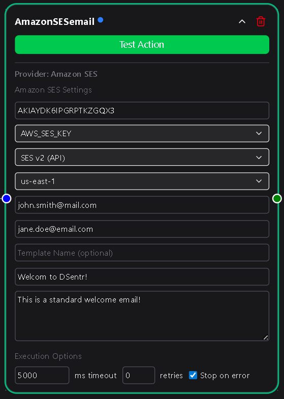
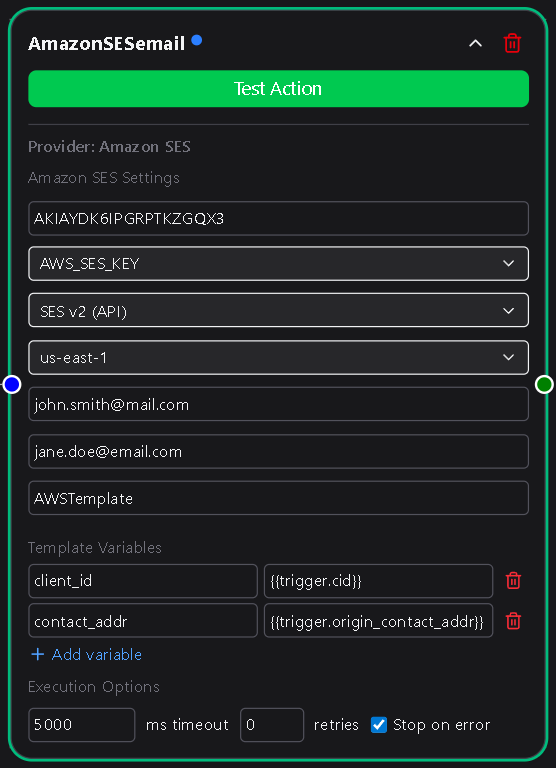

# Amazon SES

The **Amazon SES Email** action node lets your workflow send emails using [Amazon Simple Email Service (SES)](https://aws.amazon.com/ses/), a high-deliverability, cost-efficient email platform built into AWS.  
This node supports both **SESv1 (Classic)** and **SESv2 (API)** endpoints, allowing you to integrate seamlessly whether you use legacy setups or the latest SES features.

With proper configuration, this node can deliver messages directly through AWS or by using stored email templates hosted in your SES account.



---

## Configuration

### AWS SES Key ID  
The **Access Key ID** of the IAM user authorized to send emails via SES.  
This key identifies the AWS account or IAM user used for sending.

You can create or retrieve an Access Key ID from the **AWS IAM Console → Users → Security credentials → Create access key**.  
Never use root credentials; always create a dedicated IAM user with `ses:SendEmail` and `ses:SendRawEmail` permissions.

**Required**

---

### AWS Secret Access Key  
The corresponding **Secret Access Key** for the above IAM user.  
This value is used to authenticate securely with AWS SES.

In DSentr, this credential is selected from a dropdown or created directly from the node.  
Once created, it’s securely stored in **Settings → Secrets & API Keys** under the **Amazon SES** section.

**Required**

---

### Endpoint Version  
Choose which SES API version your account uses:
- **SESv2 (API)** — Modern endpoint offering full feature support, recommended for most users.  
- **SESv1 (Classic)** — Legacy endpoint for older AWS integrations.

**Required**

---

### Location  
Select the AWS region your SES service operates in.  
This determines which regional endpoint DSentr connects to for sending messages.

Available options:
```
us-east-1
us-east-2
us-west-1
us-west-2
eu-west-1
eu-west-2
eu-central-1
ap-southeast-1
ap-southeast-2
ap-northeast-1
```


Choose the same region where your SES domain and verified identities are configured.

**Required**

---

### From  
The sender email address displayed in outgoing messages.  
This address must be **verified** in your SES account before it can send emails.  
To verify an address or domain, visit **Amazon SES → Verified Identities** in the AWS Console.

**Required**

---

### To  
A comma-separated list of one or more recipient email addresses.  
For example:  
`user1@example.com, user2@example.com`


**Required**

---

### Template Name *(optional)*  
If you’re using an **SES email template**, specify its name here.  
When a template name is provided:
- The **Subject** and **Body** fields are hidden.  
- A **Template Variables** section becomes available to define key-value pairs that match placeholders in your SES template.  



For example, if your AWS template includes variables like `{{firstName}}` or `{{orderId}}`, you can define:

| Key | Value |
| --- | --- |
| firstName | `{{trigger.customer_name}}` |
| orderId | `{{workflow.last_order_id}}` |

These values are substituted dynamically at send time.  
If no template name is provided, the Subject and Body fields become active.

**Optional**

---

### Subject  
The subject line of the email.  
This field appears only when **Template Name** is blank.

**Required if no Template Name**

---

### Body  
The main content of the email, supporting both plain text and HTML.  
This field is hidden if a Template Name is specified.

**Required if no Template Name**

---

## Usage Notes

- Ensure that your SES account is out of **sandbox mode** before sending to unverified recipients.  
  In sandbox mode, SES can only send to verified email addresses or domains.  
  You can request production access in the [SES Sending Limits Console](https://docs.aws.amazon.com/ses/latest/dg/request-production-access.html).  
- Both Key ID and Secret are securely stored and never displayed after creation.  
- Combine this node with conditional logic to trigger different templates for various workflow events.

---

The Amazon SES Email node brings AWS-level reliability and scalability to your automated workflows.  
Whether you’re sending transactional messages, bulk notifications, or dynamic template-based emails, it provides secure, high-throughput delivery directly within DSentr.
