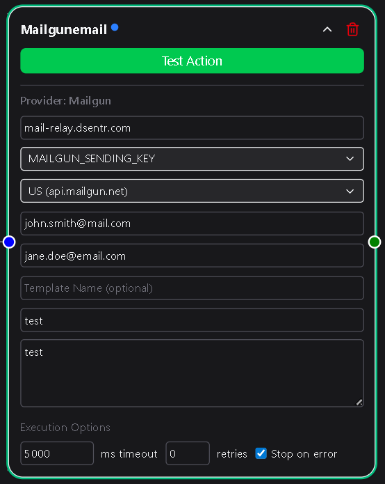
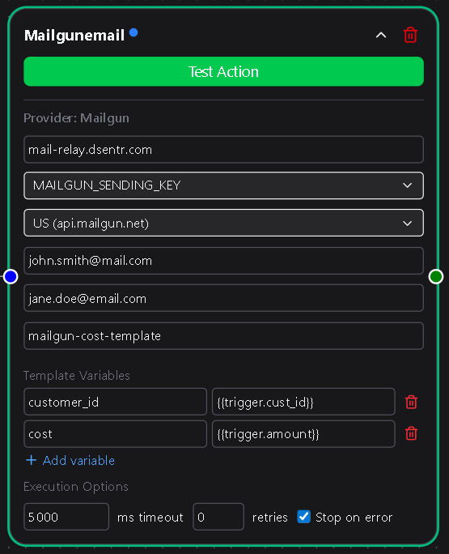

# Mailgun

The **Mailgun Email** action node enables your workflow to send reliable, authenticated emails through [Mailgun](https://www.mailgun.com/).  
It’s ideal for transactional messages, notifications, and automated communication built directly into your DSentr workflows.

Like the SendGrid node, Mailgun lets you send simple custom messages or leverage preconfigured templates hosted in your Mailgun account.  
The node manages all authentication and delivery so you can focus on automation, not SMTP headaches.

---

## Configuration

### Domain  
Your **Mailgun domain**—for example:  
`mg.yourdomain.com`

This domain must exist in your Mailgun account and be properly verified to send emails.  
You can find it under the **Domains** section of your Mailgun dashboard.

**Required**

---

### Sending Key  
The API key associated with your Mailgun domain.  
When you enter it, DSentr securely stores it under **Settings → Secrets & API Keys** in the **Mailgun** section for reuse in other workflows.

You can generate a new sending key in your Mailgun dashboard under **Settings → API Keys**.

**Required**

---

### Location  
Choose the API endpoint based on your account region:
- **US** → `api.mailgun.net`  
- **EU** → `api.eu.mailgun.net`  

This ensures your workflow connects to the correct Mailgun data center for your domain.

**Required**

---

### Email Sender  
The email address that appears in the **From** field.  
Example:  
`support@yourdomain.com`

This address must belong to your verified Mailgun domain.

**Required**

---

### Email Recipients  
A comma-separated list of one or more recipient addresses.  
For example:  
`user1@example.com, user2@example.com, user3@example.com`

**Required**

---

### Template Name *(optional)*  
If you use **Mailgun templates**, you can enter the template name here to send dynamic messages defined in your Mailgun account.  
When a template name is provided:
- The **Subject** and **Body** fields are hidden.  
- A **Template Variables** section appears where you can define key-value pairs for template placeholders.

Each variable represents a placeholder defined in your Mailgun template.  
For example, if your template contains variables like `{{recipient_name}}` or `{{order_id}}`, you can define:

| Key | Value |
| --- | --- |
| recipient_name | `{{trigger.customer_name}}` |
| order_id | `{{action.latest_order_id}}` |

These variables are replaced automatically when the email is sent.  
If the **Template Name** field is empty, the Subject and Body fields appear instead.

**Optional**

---

### Subject  
The subject line of the email.  
Visible only when **Template Name** is left blank.

**Required if Template Name is blank**

---

### Body  
The message content of the email, supporting both plain text and HTML.  
Visible only when **Template Name** is left blank.

**Required if Template Name is blank**

---

## Usage Notes

- Mailgun requires DNS verification before you can send from a custom domain. Make sure your SPF and DKIM records are set correctly.  
- Template variables can reference data from other nodes using DSentr’s templating syntax, such as `{{trigger.email}}` or `{{workflow.output_message}}`.  
- Error messages from Mailgun’s API (invalid domain, missing fields, or template errors) appear in your workflow’s **Run Logs** for easy troubleshooting.  
- The node handles all authentication securely through stored credentials—you never expose API keys directly in workflows.

---

## Example Use Cases

- Send automated signup confirmations or password reset emails.  
- Deliver purchase receipts or shipping notifications using Mailgun templates.  
- Notify teams or users dynamically by combining this node with conditional logic.  

---

The Mailgun Email node provides a fast, dependable bridge between DSentr and Mailgun’s email delivery network.  
Whether you’re sending a few messages or scaling to thousands per day, this node keeps your communication automated, authenticated, and on brand.
