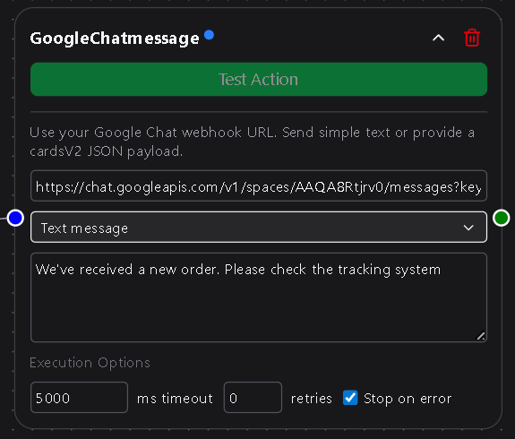

# Google Chat

The **Google Chat** message node allows your workflows to send messages directly to a Google Chat space using a simple webhook connection.  
Unlike other messaging nodes, this one intentionally skips OAuth for now so that **Solo plan** users can still automate chat notifications without complex authentication setup.

---

## Overview

Google Chat supports two types of messages: plain text messages and rich **cardsV2 JSON** payloads.  
You can use this node to send quick alerts or fully structured card messages with sections, buttons, and layouts—depending on what your webhook and Chat space allow.



---

## Configuration

### Webhook URL  
The webhook endpoint associated with a Google Chat space.  
You can create one in your Google Chat space by selecting **Apps & Integrations → Webhooks → Add Webhook** and copying the generated URL.  
This URL authenticates the request to your Chat space.

**Required**

---

### Message Type  
Determines how the message will be sent to Google Chat.  
Select one of the following options:

- **Text Message** – Sends a simple plain-text message.  
- **Card JSON (cardsV2)** – Sends a JSON object that defines rich card layouts, images, buttons, and formatted sections.  

**Required**

---

### Message  
The message text to send to the Chat space.  
Only visible when **Text Message** is selected.

Supports DSentr’s variable templating syntax (e.g., `{{trigger.value}}`, `{{workflow.output}}`).

**Required if “Text Message” is selected**

---

### CardsV2 JSON  
A [cardsV2](https://developers.google.com/chat/api/guides/v1/messages/create#json) formatted JSON object that defines your card structure.  
Only visible when **Card JSON (cardsV2)** is selected.

This field accepts full JSON content for rich card messages, including:
- Headers and sectioned content  
- Buttons and interactive elements  
- Images, icons, and formatted text  

Example:
```json
{
  "cardsV2": [
    {
      "cardId": "sample",
      "card": {
        "header": {
          "title": "New DSentr Workflow Run",
          "subtitle": "Workflow ID: {{workflow.id}}"
        },
        "sections": [
          {
            "widgets": [
              { "textParagraph": { "text": "A new execution has started." } }
            ]
          }
        ]
      }
    }
  ]
}
```

**Required if “Card JSON (cardsV2)” is selected**

---

## Usage Notes

- Google Chat webhooks only accept **text** or **cardsV2 JSON** payloads. Any other structure will be rejected with a `400 Bad Request` error.  
- The node does not require authentication; access control is handled by the webhook URL itself. Keep this URL private to avoid unauthorized posting.  
- CardsV2 support allows advanced message formatting and is compatible with most Chat spaces that support interactive content.  
- If your message isn’t appearing in Chat, double-check that the webhook is enabled and associated with the correct space.  
- Google OAuth integration for Chat is planned for Workspace plan users in future releases.

---

### Workspace & Webhook Setup Notes  

Before the Google Chat Message node can send messages, make sure your Google Workspace and Chat space are configured properly.  
If webhooks are disabled or not appearing in your Chat space, an administrator may need to adjust settings in the Google Workspace Admin Console.

- Your account must be a **Google Workspace** account (the “+ Add webhooks” option is not available for personal consumer accounts).  
  [Google Support: Why “Add webhooks” might be unavailable ›](https://support.google.com/chat/thread/337660752/cannot-add-webhooks-in-google-chat-personal-account-add-webhooks-button-greyed-out?hl=en)  
- In the Chat space you’ll use:
  1. Open the space menu → **Apps & integrations** → **Add webhooks**.  
     [Guide: How to create a Google Chat incoming webhook ›](https://help.moveworkforward.com/google-workspace/how-to-create-google-chat-incoming-webhook-for-g-1)  
  2. Enter a name (and optionally an avatar) for your webhook, then save and copy the generated **Webhook URL**.  
  3. Paste the Webhook URL into the node’s **Webhook URL** field in DSentr.  
- Confirm your workspace allows external posting via webhooks. If messages don’t appear, check that the webhook is active and that no organization policy is blocking external messages.  
  [Admin help: Managing Google Chat apps and webhooks ›](https://support.google.com/a/answer/7651360?hl=en)  
- Keep the Webhook URL private—anyone with it can post to your Chat space.  
- Note: Google Chat enforces webhook rate limits (roughly 1 request per second per space).  
  [Developer Docs: Webhook quickstart and limits ›](https://developers.google.com/workspace/chat/quickstart/webhooks)  

Following these steps ensures that your Google Chat webhook is correctly configured and ready to receive automated messages from DSentr.

---

The Google Chat Message node gives you a lightweight way to connect DSentr workflows to Chat spaces, perfect for alerting, logging, and basic status updates.  
Even without OAuth, it provides a reliable bridge for sending notifications straight into your team’s Google workspace.

