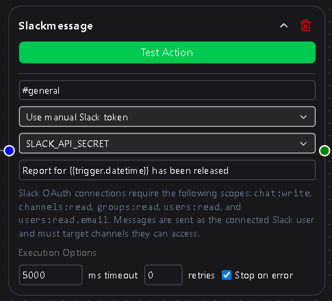
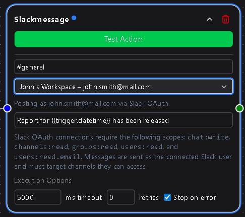

# Slack

> **Workspace Plan Only**  
> The Slack integration is available exclusively to Workspace plan users.

The **Slack Message** action node lets your workflow send automated messages directly to Slack channels that you or your workspace members have access to.  
It’s perfect for alerts, notifications, summaries, or any event-driven message you want to push to a Slack workspace without lifting a finger.

Messages can be sent through a **manual Slack token** or a **connected OAuth integration**, giving you flexibility in how you authenticate and post.

---

## Configuration

### Channel  
Select the Slack channel that will receive the message.  
The dropdown automatically lists channels that the connected account or token has permission to access.  
You can send to public or private channels, as long as the connection used has appropriate access.

**Required**

---

### Connection  
Choose how to authenticate with Slack:
- **Manual Slack Token** — Use a personal or bot token stored in **Secrets & API Keys**.  
- **OAuth Connection** — Use a Slack OAuth connection previously configured under **Settings → Integrations**.  

If no OAuth connection exists, only the manual Slack token option will be available.

**Required**

---

### Slack Token  
Appears only if the **Manual Slack Token** option is selected.  
This dropdown lets you select an existing token or create a new one.  
Tokens are securely stored under **Secrets & API Keys → Slack** for reuse in other workflows.

If an **OAuth connection** is selected, this field is hidden, since credentials are handled automatically through OAuth.

**Required if using Manual Slack Token**

---

### Message  
The message text to send to the selected Slack channel.  
You can include templated variables such as `{{trigger.value}}` or `{{workflow.result}}` to dynamically insert content from your workflow.

Supports basic Slack formatting (bold, italics, links, code blocks, etc.).

**Required**

---

## Usage Notes

- If using a **manual Slack token**, ensure it has the correct scopes (`chat:write`, `channels:read`, `groups:read`) for your intended behavior.  
- **OAuth connections** simplify authentication and are preferred for workspace plans, since they allow shared team use without managing raw tokens.  
- Combine with conditional logic to send Slack alerts only under specific conditions—like failed API responses or specific data thresholds.  
- All sent messages appear instantly in your Slack workspace, tagged as being from your configured bot or user identity.

---

The Slack Message node is one of the most versatile tools in DSentr, ideal for instant feedback loops, system monitoring, and user engagement.  
It brings real-time communication into your workflows so that the moment something happens—your team knows about it.
