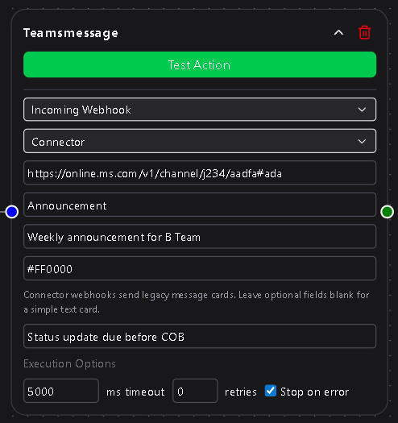
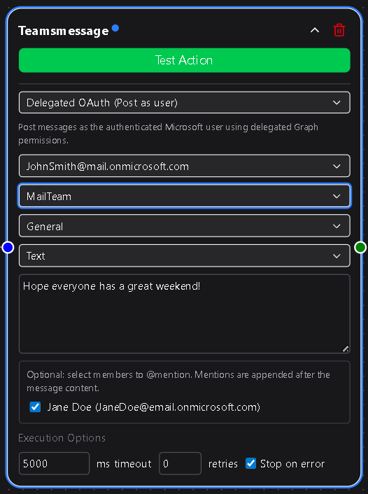

# Microsoft Teams

> **Workspace Plan Only**  
> The Microsoft Teams integration is available exclusively to Workspace plan users.

The **Microsoft Teams Message** node lets your workflows send automated messages to Teams channels through either a **Webhook** or **Delegated OAuth** connection.  
It supports simple notifications via incoming webhooks or fully authenticated messages that post as the connected user, with options for plain text or rich Adaptive Cards.

---

## Quick Overview

| Use Case | Connection Type | Highlights |
|-----------|-----------------|-------------|
| Simple alerts, status updates | Incoming Webhook | Quick setup, no authentication required |
| Power Automate or workflow endpoints | Webhook (Workflow/Power Automate) | Sends raw JSON payloads or signed requests |
| Personalized messages or mentions | Delegated OAuth (Post as user) | Posts as the authenticated user, supports mentions |
| Adaptive Cards or formatted layouts | Delegated OAuth – Card | Rich messages with layout and interactivity |

---

## 1. Webhook Connections

Webhook connections are lightweight and ideal for sending quick notifications or structured payloads without full authentication.

### Connector Webhook
The easiest method to send a message into a Teams channel.
- **Webhook URL** – The URL generated from the “Incoming Webhook” connector in Teams.  
- **Card Title** *(optional)* – Adds a title to your message card.  
- **Summary** *(optional)* – Short descriptive text below the title.  
- **Theme Color (hex)** *(optional)* – Accent color for the card.  
- **Message** *(required)* – The text content to post.

### Workflow / Power Automate Webhook
Used when posting to Microsoft Power Automate flows or other automation endpoints.
- **Webhook URL** – The endpoint URL from your Power Automate flow.  
- **Payload Type** – Choose between:
  - **Basic (Raw JSON)** – Directly send a JSON body.
  - **Header Secret Auth** – Adds a signed header for security.
    - **Header Name** and **Header Secret** become visible when this option is chosen. Secrets are managed under **Settings → Secrets & API Keys**.
- **Raw JSON Payload** – The full message body or data object your flow expects.

---

## 2. OAuth Connections (Post as User)

OAuth connections enable posting directly as a Microsoft 365 user through the Microsoft Graph API.  
This provides access to Teams, channels, mentions, and Adaptive Cards.

### Basic Setup
- **Connection** – Select a Teams OAuth connection configured under **Settings → Integrations**.  
- **Team** – Choose one of the Teams associated with the OAuth user.  
- **Channel** – Select the channel within that Team.  
- **Message Type** – Choose **Text** or **Card**.

### Text Messages
For quick alerts or standard notifications:
- **Message** – Message text. Supports DSentr’s templating (e.g., `{{trigger.name}}`).  
- **User Mentions** *(optional)* – Select users from the channel to tag them.

### Card Messages
For structured layouts or visual summaries:
- **Card Type** – Choose **Simple Card Builder** or **Custom JSON**.
  - **Simple Card Builder** – Offers easy fields for:
    - **Card Title** *(optional)*  
    - **Card Message** *(required)*  
  - **Custom JSON** – Accepts full [Adaptive Card](https://adaptivecards.io/designer/) JSON for advanced designs.

---

## 3. Choosing the Right Option

![Placeholder – Comparison image showing Webhook vs OAuth path]

| Scenario | Recommended Method |
|-----------|-------------------|
| Fast, one-way notifications | Connector Webhook |
| Sending structured data to Power Automate | Workflow / Power Automate Webhook |
| Posting as yourself or mentioning others | Delegated OAuth |
| Sending Adaptive Cards or custom layouts | Delegated OAuth – Card |

---

## 4. Notes and Best Practices

- **Webhook (Connector)** is the simplest and fastest setup, though Microsoft classifies it as *legacy*. It remains functional and is widely used for system notifications.  
- **Power Automate webhooks** expect strict payload structure—test with sample data before deploying.  
- **OAuth connections** provide the most flexibility but require setup under **Settings → Integrations** with user consent.  
- When using **Card** messages, verify JSON structure with the [Adaptive Card Designer](https://adaptivecards.io/designer/) before saving.  
- Ensure your connection or webhook URL has permission to post to the selected channel.

---

## 5. Setting Up Delegated OAuth for Teams

Setting up OAuth requires configuration on Microsoft’s side before it can be used within DSentr.  
You’ll need to register an application in Azure Active Directory, grant the correct permissions (scopes), and enable Graph API access for Teams messaging.

Refer to Microsoft’s official documentation for current steps and scopes:  
[Microsoft Graph permissions for Teams messaging](https://learn.microsoft.com/en-us/graph/permissions-reference#teams-permissions)  

Once configured, the connection can be created under **Settings → Integrations** in DSentr, ready for use by any workspace member with access.

---
The Teams Message node connects DSentr automations directly to your collaboration environment.  
Whether you’re firing a simple alert or delivering a fully formatted card with live data, this node keeps your workflows and your team in sync.
