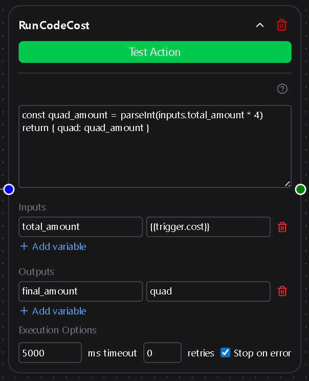

# Run Code

The **Run Code** node lets workflows execute custom JavaScript using data from previous nodes and output results for later steps.  
It’s ideal for transforming data, performing calculations, or adding logic between actions.



---

## Quick Overview

| Use Case | Description | Example |
|-----------|--------------|----------|
| Transforming or combining inputs | Apply logic or calculations between nodes | Parse JSON, sum values, clean data |
| Conditional logic | Control downstream flow with computed results | Return flags or booleans |
| Data shaping | Format output for APIs or messaging nodes | Build structured objects |

---

## 1. JavaScript Code

This is the main text area where you write your script.  
The script executes when the workflow runs and can access any defined **Inputs**.  
You must include a `return` statement to produce output.

Example:  
```js
const total = Number(inputs.price) * Number(inputs.quantity)
return { total }
```

---

## 2. Inputs

Optional key–value pairs that make data from previous nodes available inside the script.  
Each key becomes a property on the `inputs` object, and all values are treated as strings.

Example mapping:
```
name → Jason  
price → 25
```

Example usage:
```js
const message = `Hello, ${inputs.name}! Each item costs $${inputs.price}.`
return { message }
```

---

## 3. Outputs

Optional key–value pairs that map properties from your returned object to named outputs.  
These outputs become available to downstream nodes in the workflow.

- The **key** is the name you want to reference later.  
- The **value** must match a property name from your returned object.

Example:  
```js
return { greeting: "Hello" }
```

Output mapping:  
```
greeting → greeting
```

Reference later:  
```
{{run_code.greeting}}
```

---

## 4. Behavior

### Object Return
When your script returns an object, each top-level property becomes available for mapping in **Outputs**.

Example:  
```js
return { total: 42, status: "ok" }
```

Available outputs: `total`, `status`

### Primitive Return
When your script returns a primitive (string, number, or boolean), Dsentr automatically wraps it in an object with a single key `result`.

Example:  
```js
return "Done"
```

Reference later:  
```
{{run_code.result}}
```

---

## 5. Quick Tips

- Use `${inputs.key}` to reference input values in strings.  
- Always include a `return` statement; otherwise, no data is passed downstream.  
- Return an object to define multiple named outputs.  
- Return a primitive for a single default output under `result`.  
- Keep your logic self-contained—each run executes in isolation.  
- Syntax errors in your code will fail the node’s execution log entry.

---

The Run Code node is the bridge between structured automation and free-form logic, giving you full control when prebuilt nodes aren’t enough.
