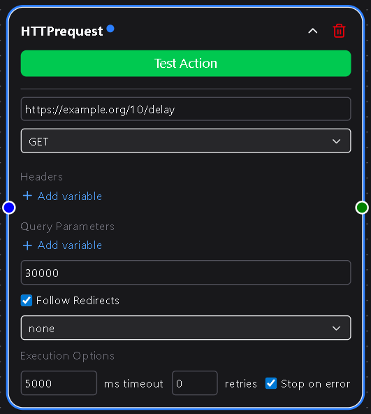

# HTTP Request

The **HTTP Request** node allows your workflows to make direct API and webhook calls.  
Use it to send data to remote endpoints, integrate external systems, or connect with services that don’t yet have native DSentr nodes.

---

## Overview

This node is one of the most versatile tools in DSentr. It gives you complete control over how HTTP requests are sent, including custom headers, query parameters, authentication methods, and timeout behavior.  
Whether you’re posting JSON to a webhook or fetching data from an external API, this node forms the backbone of many advanced workflows.

---

## Configuration

### URL  
The endpoint that the request will be sent to.  
Must be a valid HTTP or HTTPS URL.

**Required**

---

### HTTP Method  
Defines how the request interacts with the endpoint.  
Choose from:

- **GET** – Retrieve data  
- **POST** – Send or create data  
- **PUT** – Replace an existing resource  
- **PATCH** – Partially update a resource  
- **DELETE** – Remove a resource  
- **HEAD** – Request headers only  
- **OPTIONS** – Inspect supported methods  

**Required**

---

### Headers  
Add key-value pairs such as `Content-Type`, `Authorization`, or any custom header required by your API.  
Headers support DSentr variable templating (e.g., `{{trigger.email}}`).

**Optional**

---

### Query Parameters  
Add querystring key-value pairs that will automatically append to the URL.  
Useful for filters, pagination, or passing tokens.

Example:  
`?status=active&page=2`

**Optional**

---

### Timeout (ms)  
Defines how long the request waits for a response before timing out.  
Default: `30000` (30 seconds).  
Increase for slower APIs.

**Required**

---

### Follow Redirects  
A checkbox that controls whether DSentr should follow HTTP `3xx` redirects automatically.  

When **enabled**, DSentr follows all redirects until the final response.  
When **disabled**, it captures the redirect response for manual inspection.  

**Optional**

---

## Authentication

The **Security Logic** dropdown determines how authentication is handled for the request.

### None  
No credentials are applied.  
Use this for open or public APIs.

---

### Basic Authentication  
Displays two fields:

- **Username** — The plain username used in the `Authorization` header.  
  **Required**  
- **Password** — A dropdown to choose or create a password stored securely in **Secrets & API Keys**.  
  **Required**

DSentr automatically base64-encodes and applies credentials to the header:  
`Authorization: Basic <encoded_credentials>`

---

### Bearer Token  
Displays one field:

- **Bearer Token** — Select or create a bearer token stored in **Secrets & API Keys**.  
  **Required**

When used, DSentr includes it as:  
`Authorization: Bearer <token>`

All stored secrets are encrypted and never exposed in plaintext.

---

## Behavior

- Each request includes a complete response object (status code, headers, and body).  
- JSON responses are automatically parsed for use by downstream nodes.  
- Non-2xx responses (e.g., `404`, `500`) will mark the node as failed unless explicitly handled.  
- Template variables can be used anywhere in the request (URL, headers, body, or parameters).  
- Supports dynamic URLs and payloads to integrate with any system that accepts HTTP calls.

---

## Example Use Cases

- Trigger an external webhook after a successful workflow run.  
- Send POST data to a REST API endpoint.  
- Fetch and process data from a third-party service.  
- Update resources in an external system.  
- Chain multiple HTTP requests together to form advanced API flows.

---

## Example Configuration

| Field | Example |
|-------|----------|
| URL | `https://api.example.com/users` |
| Method | `POST` |
| Headers | `Content-Type: application/json` |
| Query Parameters | `team=marketing` |
| Timeout | `30000` |
| Follow Redirects | ✅ |
| Security Logic | Bearer |
| Bearer Token | `{{secrets.api_token}}` |

---

## Tips

- Use **template variables** to build dynamic payloads that include workflow data.  
- Check API rate limits when chaining multiple requests.  
- Keep your Secrets organized in **Settings → Secrets & API Keys** to simplify reuse across workflows.  
- For debugging, log full request and response data using a downstream node.

---

The **HTTP Request** node is a cornerstone of advanced automation in DSentr.  
It bridges your workflows with nearly any API or service on the internet, giving you unlimited integration possibilities.
