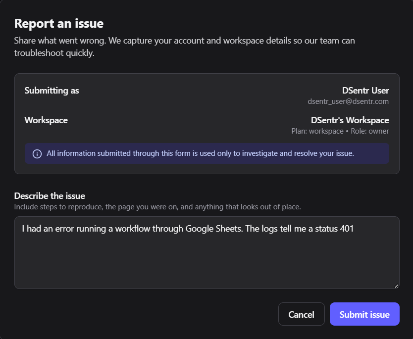
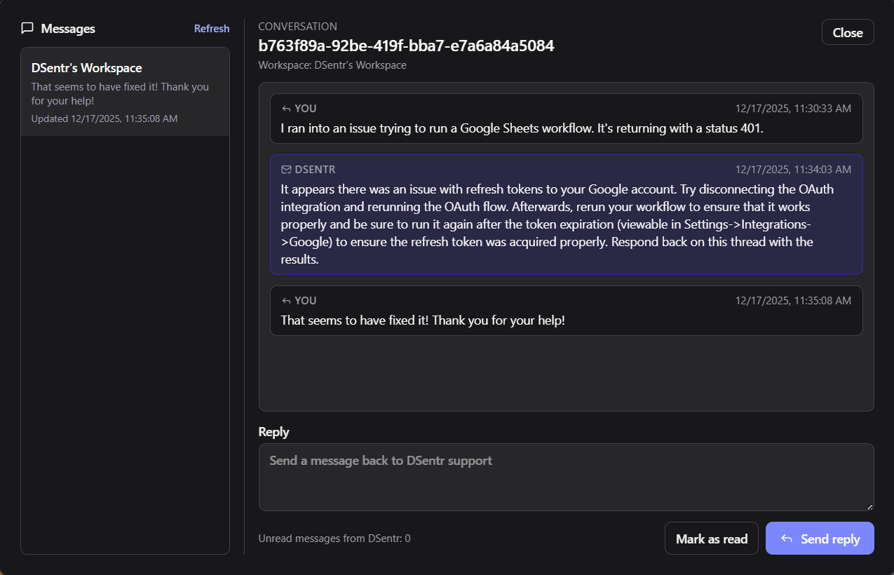

## Getting Help

If something breaks, behaves strangely, or just refuses to cooperate, support is built directly into DSentr. No emails. No external ticket system. No scavenger hunt.

## Submitting an Issue

When you run into a problem:

- Click the **Issue** button in the top navigation bar.
- A support form opens inside the app.
- Fill in the details of what went wrong.

The form asks for:

- A short summary of the issue.
- A clear description of what you were trying to do.
- What you expected to happen.
- What actually happened.
- Any relevant workflow, node, or run context.

Be specific. Vague reports slow things down for everyone, including you.

Submit an issue: 

Issue submission form

## What Happens Next

Once submitted:

- Your issue is logged for investigation.
- The DSentr team reviews the report and associated context.
- Follow-up questions or updates are sent through **DSentr’s internal messaging system**.

You do not need to monitor email or re-submit anything. All communication stays inside the platform.

## Replies and Updates

Support responses appear in your internal messages:

- Requests for clarification.
- Status updates.
- Resolution notes or workarounds.

You can reply directly in the thread to continue the conversation.

System Messages: 

System Messages Thread:

## Scope of Support

Support covers:

- Platform bugs.
- Workflow execution failures.
- Integration issues.
- Billing and plan questions.
- Security or access concerns.
